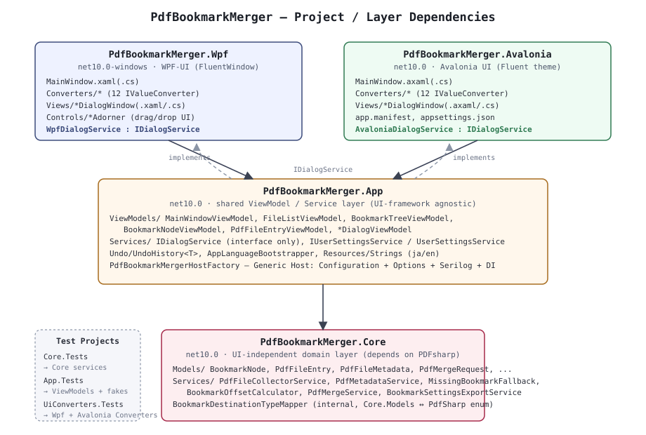

# 01. Architecture

## 1. Layer structure

- **`PdfBookmarkMerger.Core`**: the domain layer that reads/writes PDFs, extracts bookmarks, and
  performs the merge logic. Depends only on `PdfSharp`; references no WPF/Avalonia UI types at all.
- **`PdfBookmarkMerger.App`**: the ViewModels and shared app services (settings persistence, i18n,
  Undo, Generic Host assembly). References no UI-framework-specific types; instead it delegates to
  each frontend through interfaces such as `IDialogService` (dependency inversion).
- **`PdfBookmarkMerger.Wpf` / `PdfBookmarkMerger.Avalonia`**: bind the `App` layer's ViewModels on
  top of their respective UI framework, and implement framework-specific concerns such as drag &
  drop, dialog presentation, and value converters.

Dependencies always flow one way — "UI framework → App → Core" — which keeps Core and App easy to
test (they run without a real window) and keeps the blast radius of swapping or adding a UI
framework relatively contained.

## 2. DI and host assembly

`PdfBookmarkMergerHostFactory.Build(args, configureUiServices)`
(`src/PdfBookmarkMerger.App/PdfBookmarkMergerHostFactory.cs`) is the shared host-assembly routine
used by both the WPF and Avalonia builds.

1. Creates `AppPaths.AppDataDirectory` / `AppPaths.LogDirectory`
   (under `%AppData%/PdfBookmarkMerger`; the registry is never used).
2. Loads `IConfiguration` from `appsettings.json` (shipped with the executable), then the user
   settings file (`settings.json`), in that order (the latter wins).
3. Configures Serilog (daily rolling file, 14-day retention; console sink added only in Debug
   builds).
4. Binds `PdfBookmarkMergerOptions` to the `"PdfBookmarkMerger"` section of the configuration.
5. Registers the Core and App layers' services/ViewModels (all Singleton) via
   `Core.ServiceCollectionExtensions.AddPdfBookmarkMergerCore()` and
   `App.ServiceCollectionExtensions.AddPdfBookmarkMergerApp()`.
6. Lets the caller (`Wpf.App` / `AvaloniaApp.App`) register the `IDialogService` implementation
   (`WpfDialogService` / `AvaloniaDialogService`) and `MainWindow` via the `configureUiServices`
   callback.

Services/ViewModels registered (excerpt):

| Layer | Registrations |
|---|---|
| Core | `IPdfFileCollectorService`, `IPdfMetadataService`, `IPdfMergeService`, `IBookmarkSettingsExportService`, `IPdfPageRenderer`, `IPdfTextExtractor`, `IPdfLinkAnnotationService` |
| App | `IUserSettingsService`, `FileListViewModel`, `BookmarkTreeViewModel`, `LinkEditorViewModel`, `MainWindowViewModel` |
| UI-framework side | `IDialogService`, `MainWindow` |

`IPdfPageRenderer`/`IPdfTextExtractor`/`IPdfLinkAnnotationService` are the Core-layer services for
the link editor screen (`WorkflowStep.EditLinks`). See
[02-core-design.md §2.8–§2.11](02-core-design.md#link-editor-services).

## 3. Startup sequence

The WPF build (`Wpf.App.OnStartup`) and the Avalonia build
(`AvaloniaApp.App.OnFrameworkInitializationCompleted`) follow nearly identical steps.

1. Build and `Start()` the host via `PdfBookmarkMergerHostFactory.Build(...)`.
2. Synchronously wait for `AppLanguageBootstrapper.ApplyAsync(userSettings)` to finish **before
   constructing `MainWindow`**, so the display language (`Strings.Culture`) is settled first (XAML
   `x:Static` references are fixed at the time the window/XAML is constructed/loaded and cannot be
   changed later).
3. Resolve `MainWindow` from the DI container, apply the theme (light/dark/system) via
   `ThemeApplier.Apply(...)`, then show it.

Unhandled exceptions are hooked as early as possible — in the `Wpf.App` constructor and in the
Avalonia build's `Program.Main`, respectively — and always logged through Serilog via
`PdfBookmarkMergerHostFactory.LogUnhandledException(...)`, so the app never crashes silently with
nothing left in the logs. Avalonia has no equivalent of WPF's `DispatcherUnhandledException`
(a UI-thread-specific hook), so the entire `StartWithClassicDesktopLifetime(args)` call is wrapped in
a `try/catch` instead.

## 4. Cross-cutting concerns

### 4.1 i18n (Japanese/English)

- The auto-generated `Strings` class (from `App/Resources/Strings.resx` — default Japanese — and
  `Strings.en.resx` — English) switches which string set it resolves via its `Culture` property.
- `AppLanguageBootstrapper.ApplyAsync` runs once at startup: it uses the saved language
  (`PdfBookmarkMergerOptions.Language`) if present, otherwise auto-detects it from the OS UI
  language and persists the result.
- Changing the language in the Settings dialog switches `Strings.Culture` immediately via
  `AppLanguageBootstrapper.ApplyImmediate`, then **reconstructs and swaps in a new `MainWindow` that
  carries the same ViewModel instance forward** (`ReplaceMainWindowForLanguageChange` in
  `WpfDialogService`/`AvaloniaDialogService`). `x:Static` references are fixed at window-construction
  time, so an existing window's text cannot be rewritten in place.

### 4.2 Undo

`App/Undo/UndoHistory<T>` (a generic snapshot stack) is used by `BookmarkTreeViewModel` specialized
to `string` (the whole tree serialized as JSON). See [03-app-design.md](03-app-design.md#undo) for
detail.

### 4.3 Busy / progress display

`MainWindowViewModel.IsBusy` / `BusyProgress` (`ReactivePropertySlim<BusyProgressInfo?>`) is treated
as the single source of truth for "processing," and the same UI (a busy overlay, plus a detail
progress text that only appears after 5 seconds) is reused across all of the following:

- File loading (`ConfirmFilesAsync`)
- Merging the PDF (`MergeAsync`)
- **Forwarding `BookmarkTreeViewModel.IsBusy`/`BusyProgress`** (since v1.2.1 — the chunked recompute
  triggered by editing/undoing on a large bookmark set. See
  [03-app-design.md](03-app-design.md#recompute) and
  [05-version-history.md](05-version-history.md#v121))

### 4.4 Where settings and logs live

`AppPaths` (`src/PdfBookmarkMerger.App/AppPaths.cs`) keeps the settings file (`settings.json`) and
logs (`logs/`) together under `%AppData%/PdfBookmarkMerger/`. It never touches the registry and
never depends on the executable's own folder (which could be read-only). Writing the settings file
goes through an atomic write-then-move (`UserSettingsService.SaveAsync`: write to a temp file in the
same folder, then `File.Move(..., overwrite: true)`) so a process kill mid-write can't corrupt the
JSON.

### 4.5 App-layer async methods never use `ConfigureAwait(false)`

ViewModel async methods (`LoadAsync`, `RecomputeAllPageNumberDisplaysAsync`, etc.) never suffix
`await` with `ConfigureAwait(false)`. The WPF build routes command `CanExecuteChanged` through
`CommandManager` (UI-thread-only), so `ConfigureAwait(false)` would move the continuation after the
first `await` onto a thread-pool thread — and the moment that continuation writes to a
`ReactivePropertySlim<T>.Value`, it throws `InvalidOperationException` (cross-thread access). A case
where this convention was accidentally broken is documented as a real incident in
[03-app-design.md §7.7](03-app-design.md#link-editor-thread).

### 4.6 `[SupportedOSPlatform]` around PDFium calls

`IPdfPageRenderer`'s implementation calls into PDFium (a native library), which the .NET analyzer
flags as CA1416 (platform compatibility). Applying `[SupportedOSPlatform]` at the class or assembly
level cascades the platform restriction onto every unrelated type in that assembly (e.g.
`BookmarkNode`), producing a flood of warnings, so instead only the 2–3 lines that actually call into
PDFium are wrapped in `#pragma warning disable/restore CA1416` (with a comment explaining why). See
[02-core-design.md §2.8](02-core-design.md#link-editor-services).
