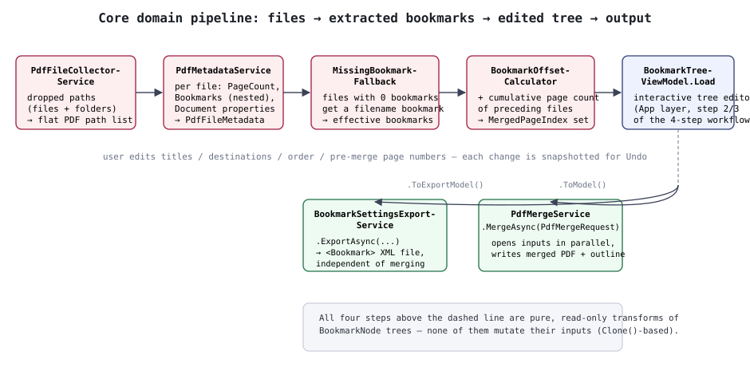

# 02. Core Layer Design

`PdfBookmarkMerger.Core` is the UI-framework-independent domain layer that owns PDF I/O and the
bookmark-merging logic. Every public service is registered as a Singleton via
`Core/ServiceCollectionExtensions.AddPdfBookmarkMergerCore()`.

## 1. Models (`Core/Models`)

| Type | Role |
|---|---|
| `BookmarkNode` | A single bookmark. Holds `Title`, `DestinationType`, coordinates (`Left`/`Top`/`Right`/`Bottom`/`Zoom`), `IsOpen`, and `Children`. The pair `SourceFileEntryId` + `OriginalPageIndex` is the immutable identity that pins down the jump-target page inside the source PDF. `MergedPageIndex` is the page number within the merged PDF (a display-only, secondary value). `PageOffset` is the delta from directly editing the pre-merge page number in the editor (null when unedited; a write/display-only adjustment that never affects the actual merge). `Clone()` returns a deep copy of itself plus descendants (with fresh Ids). |
| `PdfFileEntry` | One entry in the merge-target file list. `FilePath`, `PageCount` (null until resolved). |
| `PdfFileMetadata` | The `PageCount`, `Bookmarks`, and `Properties` read from a single file. |
| `PdfDocumentPropertiesModel` | Title/Author/Subject/Keywords/Creator. The default properties for the merged output reuse the first merge-target PDF's values. |
| `PdfMergeRequest` | Input to `PdfMergeService.MergeAsync` (file order, the edited bookmark tree, output properties, output path). |
| `MergeProgress` | `record(int CompletedFileCount, int TotalFileCount, string CurrentFileName)` — progress notification for the merge process. |
| `BookmarkDestinationType` | Only 4 values: `XYZ` / `Fit` / `FitH` / `FitV` (the bounding-box variants `FitB*` and the rectangle variant `FitR` aren't exposed in the UI and get simplified on read). |

`BookmarkNode` deliberately separates "where it sits in the bookmark tree" (`SourceFileEntryId` +
`OriginalPageIndex`) from "where it displays after merging" (`MergedPageIndex`). That way, reordering
the merge order or adding/removing files never changes the identity used to pin down the jump-target
page.

## 2. Domain services (`Core/Services`)

### 2.1 `PdfFileCollectorService`

`ExpandToPdfFilePaths(droppedPaths)` — expands the paths handed over from D&D/dialogs (a mix of
files and folders) into an actual list of PDF file paths. Folders are scanned non-recursively (only
their direct contents); anything that isn't a `.pdf` or doesn't exist is ignored and logged.

### 2.2 `PdfMetadataService`

- `ReadPageCountAsync(filePath)` — reads only the page count, quickly (used for the provisional page
  count shown right after adding a file to the list).
- `ReadMetadataAsync(file)` — reads page count, bookmark tree, and document properties together
  (used during bookmark extraction).

Bookmark extraction (`ExtractOutlines`) walks the `PdfOutlineCollection` recursively, resolving each
outline's jump-target page via a dictionary built once by reference comparison
(`BuildPageIndexLookup`, using `ReferenceEqualityComparer`). A bookmark whose target page can't be
resolved is logged as a warning and skipped.

Two known PDFsharp 6.2.4 workarounds are contained inside this service.

1. **Normalizing NaN coordinates** (`AsFiniteOrNull`) — depending on the destination type,
   `Left`/`Top`/`Right`/`Bottom`/`Zoom` can come back as NaN/Infinity. Keeping that as-is would throw
   when the Undo snapshot is JSON-serialized, and would also get written back into the output PDF as
   an invalid value, so it's normalized to `null` (meaning "unspecified").
2. **Reading the open/closed state** (`ReadOpened`) — `PdfOutline.Opened` has a known bug where it
   misreads the sign of `/Count` (the field that encodes open/closed state), even though `/Count`
   itself is written correctly. The workaround reads `/Count` directly, falling back to the
   library's default for leaf nodes and the like where `/Count` doesn't exist.

### 2.3 `MissingBookmarkFallback`

`ResolveEffectiveBookmarks(orderedFiles, metadataByFileId)` — for each PDF that has zero bookmarks,
resolves an "effective bookmark list" that fills in a single bookmark titled after the filename
(without extension). Its destination type follows the previous file's setting (coordinates are not
carried over). Non-destructive: it never touches its input, always returning a freshly built result.

### 2.4 `BookmarkOffsetCalculator`

`ComputeMergedBookmarks(orderedFiles, effectiveBookmarksByFileId, metadataByFileId)` — computes a
cumulative page-count offset following the merge order, and returns a cloned tree (concatenated in
file order) with each bookmark's `MergedPageIndex` set. Never mutates its input.

### 2.5 `PdfMergeService`

`MergeAsync(request, progress, ct)` runs in two phases.

1. **Phase 1 (parallel)**: opens each input PDF via `PdfReader.Open` (disk I/O + structure parsing).
   A `SemaphoreSlim` caps concurrency at `Math.Clamp(Environment.ProcessorCount, 1, 8)` to avoid
   thread-pool exhaustion and too many open file handles.
2. **Phase 2 (single-threaded)**: appends each opened PDF's pages onto the output `PdfDocument`
   (`AddPage`, mostly fast in-memory copying). Reports `MergeProgress` after every page addition.

`ApplyBookmarks` then rebuilds the outline on the output side using a
`(SourceFileEntryId, OriginalPageIndex)` → actual-page map. For nodes that have children, it works
around a known PDFsharp 6.2.4 bug where `/Count` (the open/closed state) doesn't get written for any
level below the first, by calling `Elements.SetInteger("/Count", ...)` directly before saving.

Even if only some files managed to open in Phase 1 (password-protected/corrupted/locked by another
process, or a cancellation), everything opened so far is still guaranteed to get `Dispose`d, since
Phases 1 and 2 are wrapped together in a single `try/finally`.

**Remapping in-page link destinations (since v1.2.3)**: PDFsharp's `AddPage` duplicates page-internal
link annotations (`/Subtype /Link`) themselves, but unlike bookmarks, it does not rewrite the page
object referenced by a link's destination (`/Dest`, or `/A`'s (GoTo action) `/D`) to point at the
merged output. Left unhandled, this meant a link's destination could end up as a dangling reference to
an object that doesn't exist in the merged PDF, or could resolve to the wrong page entirely. The fix
reuses the same `pageMap` idea `ApplyBookmarks` relies on: for each file it builds a
"source page object ID → original page index" lookup (`sourcePageIndexByObjectId`), uses it to
identify which original page a destination pointed at, resolves that through `pageMap` to the correct
merged page, and then overwrites the first element (the page reference) of the copied annotation's
`/Dest`/`/A`/`D` array in place. Named destinations (where `/Dest` is a name or string) are out of
scope.

### 2.6 `BookmarkSettingsExportService` (since v1.2.0)

`ExportAsync(bookmarks, outputPath, ct)` — writes the bookmark tree out per the "bookmark settings
file spec" (UTF-8 XML, nested `<Title Page="..." Action="GoTo">` elements directly under a root
`<Bookmark>`). The `Page` attribute is written with the same argument order as the PDF Reference's
destination types (Fit/FitH/FitV/XYZ); an unset (null) argument is filled with `0`, since the spec
treats that as equivalent to null. The XML declaration line is written by hand, because
`XmlWriter`'s default output (lowercase `"utf-8"`) doesn't match the spec's example verbatim.

### 2.7 `BookmarkDestinationTypeMapper` (internal)

Converts between `Core.Models.BookmarkDestinationType` and PDFsharp's `PdfPageDestinationType`. The
conversion logic lives in the Services layer specifically to keep Models free of any library
dependency.

## 3. The Core layer's processing pipeline, end to end

In the diagram, the four stages above the dashed line (`PdfFileCollectorService` →
`PdfMetadataService` → `MissingBookmarkFallback` → `BookmarkOffsetCalculator`) are all read-only,
non-mutating transforms (built on `Clone()`). Only once the result reaches
`BookmarkTreeViewModel.Load` does it become an editable object (in the App layer). The edited tree is
then handed back to Core-layer services in two shapes: `ToModel()` (for the PDF merge) and
`ToExportModel()` (for the bookmark settings file export, with the pre-merge page-number edit
cascade already baked in).
