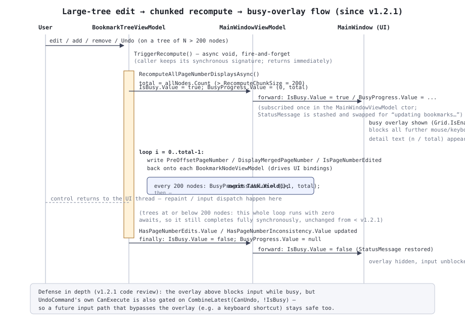

# 03. App層設計

`PdfBookmarkMerger.App` はUIフレームワークに依存しないViewModel層・アプリ共通サービス層。
`ServiceCollectionExtensions.AddPdfBookmarkMergerApp()` で `IUserSettingsService` /
`FileListViewModel` / `BookmarkTreeViewModel` / `MainWindowViewModel` をSingleton登録する。

いずれのViewModelも `ViewModelBase`(`CompositeDisposable Disposables` を持つだけの薄い基底クラス)
を継承し、[Reactive.Bindings](https://github.com/runceel/ReactiveProperty) の
`ReactivePropertySlim<T>` / `ReactiveCommand` / `AsyncReactiveCommand` でプロパティ・コマンドを
公開する。

## 1. `MainWindowViewModel`

メインウィンドウ全体を統括し、`Step`(`WorkflowStep.SelectFiles` → `EditBookmarks`)の遷移と
4つの主要コマンドを管理する。

| コマンド | CanExecute | 処理 |
|---|---|---|
| `ConfirmFilesCommand` | `HasFiles && !IsBusy` | 全ファイルのメタデータを並列読込 → しおり抽出・結合後ページ番号計算 → `BookmarkTree.Load` → `Step = EditBookmarks` |
| `MergeCommand` | `(Step==EditBookmarks) && !IsBusy && !HasPageNumberEdits` | 保存先ダイアログ→(設定により)プロパティ編集ダイアログ→`PdfMergeService.MergeAsync` |
| `SaveBookmarkSettingsCommand` | `(Step==EditBookmarks) && !IsBusy && !HasPageNumberInconsistency` | 保存先ダイアログ→`BookmarkSettingsExportService.ExportAsync` |
| `BackToFileListCommand` | `(Step==EditBookmarks) && !IsBusy` | `Step = SelectFiles` に戻る |

`ConfirmFilesAsync` は各ファイルのメタデータ読込を `SemaphoreSlim`(上限
`Math.Clamp(Environment.ProcessorCount, 1, 8)`)で並列化し、`Task.WhenEach` で完了順に結果を
反映する。一部ファイルの読込失敗は `PdfFileEntryViewModel.LoadFailed` へ記録され、
以後のしおりツリー構築・実際のPDF結合(`MergeAsync`)の**両方**から一貫して除外される
(過去の回帰: しおりツリーからは除外されるが結合対象には残ってしまうバグの再発防止テストあり)。

`MergeCommand` が `!HasPageNumberEdits` を要求するのは、結合前ページ数編集中は結合後PDFの
実際のページ位置と画面表示・書き出し内容が食い違うため。`SaveBookmarkSettingsCommand` が
`!HasPageNumberInconsistency` を要求するのは、編集の結果ページ数が1未満になるような不整合が
起きている場合、正しいXMLを書き出せないため(`HasPageNumberEdits`/`HasPageNumberInconsistency`は
`BookmarkTreeViewModel` 側で管理、後述)。

### 1.1 busy / progress の転送(v1.2.1〜)

```csharp
BookmarkTree.IsBusy.Subscribe(busy => { ...; IsBusy.Value = busy; });
BookmarkTree.BusyProgress.Subscribe(p => BusyProgress.Value = p);
```

コンストラクタでこの2行を購読することで、`BookmarkTreeViewModel` 内部の大量ノード再計算
(後述 [§2.6](#recompute))による busy状態を、ファイル読込・PDF結合と同じ `IsBusy`/`BusyProgress`
経由でUI(処理中オーバーレイ)へそのまま反映する。busy開始時は現在の `StatusMessage` を退避して
「しおりの情報を更新しています…」に差し替え、終了時に復元する。

## 2. `BookmarkTreeViewModel`

しおり編集ツリー(手順2/3)の中心ViewModel。D&Dによる並べ替え・再親子付け、追加・削除・
レベル操作、タイトル等の編集結果を `Core.Models.BookmarkNode` ツリー(`_rootModel`)へ同期する。

### 2.1 公開プロパティ

| プロパティ | 型 | 役割 |
|---|---|---|
| `RootNodes` | `ObservableCollection<BookmarkNodeViewModel>` | ルート直下のノード一覧(UIバインド対象) |
| `ForceFitForAll` | `ReactivePropertySlim<bool>` | オンの間、全ノードの表示方法・座標コントロールを不活性化し結合時は一律Fit扱い(個々の設定値自体は変更しない) |
| `GlobalExpandOverride` | `ReactivePropertySlim<bool?>` | 「一律で展開表示を設定」の3状態(true=全展開/false=全収納/null=個別設定に従う) |
| `CanUndo` / `UndoCommand` | — | 後述 [§2.4](#undo) |
| `HasPageNumberEdits` / `HasPageNumberInconsistency` | `ReactivePropertySlim<bool>` | 結合前ページ数編集の状態(`MainWindowViewModel` のCanExecuteへ伝播) |
| `IsBusy` / `BusyProgress` | `ReactivePropertySlim<bool>` / `ReactivePropertySlim<BusyProgressInfo?>` | 後述 [§2.6](#recompute) |
| `TitleColumnBaseWidth` | `ReactivePropertySlim<double>` | タイトル列の共有基準幅。実測はUI側(`MainWindow.xaml.cs`等)が行う |
| `ExpandLevelInput` / `CollapseAllCommand` / `ExpandAllCommand` | — | 後述 [§2.7](#expand-level) |

### 2.2 構造編集(追加・削除・移動・レベル操作)

`AddRoot` / `AddChild` / `AddSiblingAfter` / `Remove` / `Move` はいずれも「Undoスナップショットを
積む → `RootNodes`(UI用ObservableCollection)と `_rootModel`(Coreモデル)の両方を更新 →
`TriggerRecompute()`」という共通パターンを踏む。`Move` は同一コレクション内移動時のインデックス
補正、および移動先が自身の子孫でないことの検証(`IsDescendantOf`)を行う。

`PromoteLevel`/`DemoteLevel` は実体としてはいずれも `Move` の特殊形(親の直後の兄弟へ/直前の
兄弟の末尾の子へ、それぞれ再配置)として実装されている。

`SetChildLevelCapAsync(node)` はダイアログで選択された絶対レベルより深い下位要素を
`TruncateBelowLevel` で一括削除する。

新規追加ノードには、その時点で有効な「一律でFitに設定」「一律で展開表示を設定」の上書きを
即座に適用する(`ApplyCurrentOverridesToNewNode`)。この適用自体は追加操作の一部として扱われ、
独立したUndoスナップショットにはならない(`_suppressUndoSnapshots` で抑止)。

### 2.3 結合前ページ数編集

`BookmarkNodeViewModel.PreOffsetPageNumber` が編集されると
`BookmarkTreeViewModel.OnPreOffsetPageNumberChanged(node, newValue)` が呼ばれ、

1. 差分 `delta = newValue - 編集前の実効値` を求める(0なら何もしない)。
2. 同一ファイル(`SourceFileEntryId`)内で、編集されたノードの `OriginalPageIndex` **以降**
   (ツリー上の表示順ではなく、抽出元PDFのページ構造上の位置基準)にある全ノードの
   `PageOffset` へ一律加算する。
3. `TriggerRecompute()` を呼ぶ。

`ResetFilePageNumbers(node)` は、個々のノード単位のリセット(そのノード以降のみ戻す)では
リセット対象より前のページへの過去編集が残ってしまうため、**同一ファイル全体**の `PageOffset` を
一括で `null` へ戻す。そのファイルに編集が1件もなければ何もせずUndo履歴も積まない。

結合後ページ数への反映は `ComputeCumulativeDeltaBeforeFile()` が担う。ファイルごとに
「そのファイル内で最も `OriginalPageIndex` が大きいノードの `PageOffset`」(=そのファイル全体に
効く累積差分。どの編集も自身の位置以降=最終ページを含む範囲に及ぶため)を求め、結合順
(`_orderedFileIds`)に沿って積算することで、各ファイルについて「自分より前のファイルの
累積差分の合計」を得る。この関数は `RecomputeAllPageNumberDisplaysAsync` と `ToExportModel` の
両方から呼ばれる、読み取り専用の集計処理(チャンク分割はしていない。プロパティ書き戻しを
伴わないため実測負荷は書き戻しループよりずっと小さい)。

<a id="undo"></a>
### 2.4 Undo

`App/Undo/UndoHistory<T>` は、スナップショットの推定サイズ(バイト)を積算し、合計が上限
(既定100MB)を超えたら最新の1件を除き最古から破棄する、メモリ量ベースのスタック。
`BookmarkTreeViewModel` はこれを `string`(`_rootModel` のJSONシリアライズ)特化で使用する。

- `PushUndoSnapshot()`(引数なし) — 構造操作の直前に呼ぶ、常に1件積むコアレスなし版。
- `PushUndoSnapshot(coalesceKey)` — プロパティ編集用。同一キーへの連続呼び出しが800ms
  (`SnapshotCoalesceWindow`)以内なら1回の編集とみなし、履歴を積み増さない
  (テキスト入力中の1文字ごとの履歴増殖を防ぐ)。
- `Undo()` — 最新スナップショットをJSONデシリアライズし `RebuildTree` へ渡す(履歴自体は
  Popされ消費される。LIFO順)。

`BookmarkNodeViewModel` の各プロパティ(`Title`/`IsOpen`/`DestinationType`/座標)は、構築時の
初回リプレイ値を `Skip(1)` で除外した上で変更ごとに `RequestUndoSnapshot` を呼ぶ。「一律で
Fitに設定」「一律で展開表示を設定」の上書き適用自体は表示上の一時的な変更(オフに戻すと自動復元)
でありUndo対象の「編集内容」ではないため、`_suppressUndoSnapshots` で抑止する。

### 2.5 `CanUndo`/`UndoCommand` のCanExecute(v1.2.1〜)

```csharp
var canUndo = CanUndo.CombineLatest(IsBusy, (canUndo, busy) => canUndo && !busy);
UndoCommand = new ReactiveCommand(canUndo);
```

大量ノードのチャンク処理中(`IsBusy`)は、処理中オーバーレイがマウス操作をブロックすることが
主な防御だが、それだけに頼らず `UndoCommand` 自身のCanExecuteにも `!IsBusy` を組み込んでいる
(オーバーレイを経由しない将来の入力経路、例えばキーボードショートカット等から進行中の
再計算と競合する余地を理論上残さないための多重防御。コードレビューで追加)。

<a id="recompute"></a>
### 2.6 大量しおり時の応答性 — チャンク処理(v1.2.1〜)



`RecomputeAllPageNumberDisplaysAsync()`(旧称 `RecomputeAllPageNumberDisplays`、内部
`_isRecomputingPageNumbers` フラグで自己書き戻しからの再帰を防ぐ)は、ツリー構造・`PageOffset`
を変更しうるすべての操作(読込・Undo・追加・削除・レベル上限切り詰め・編集)の後に呼ばれ、
全ノードの `PreOffsetPageNumber`/`DisplayMergedPageNumber`/`IsPageNumberEdited` を再計算して
書き戻し、`HasPageNumberEdits`/`HasPageNumberInconsistency` を更新する。

対象ノード数が `RecomputeChunkSize`(200件)を超える場合のみ、書き戻しループを200件ごとの
チャンクに分割し、各チャンクの合間に `await Task.Yield()` でUIスレッドへ制御を返す。この間
`IsBusy`/`BusyProgress` を更新し、`MainWindowViewModel` が自身の同名プロパティへ転送することで、
専用UIを新設せずファイル読込時と同じ処理中オーバーレイ・進捗表示を再利用する。200件以下の
小規模なツリーでは内部で一度も `await` が発生せず、これまでどおり完全に同期的に完了する
(小規模ツリーでの不要なオーバーヘッド・ちらつきを避けるため)。

構造編集メソッド群(`AddRoot`等)は同期メソッドのままシグネチャを変えずに済ませるため、
`TriggerRecompute()`(`async void` のfire-and-forgetラッパー)を経由して呼び出す。

```csharp
private async void TriggerRecompute() => await RecomputeAllPageNumberDisplaysAsync();
```

小規模ツリーでは内部で一度もawaitしないため、このメソッドから戻った時点で実質的に処理は
完了しており、既存の同期呼び出し前提のテスト・コードビハインドは無改修で動作する。大規模ツリーでは
処理中オーバーレイがしおり編集画面全体を覆いマウス操作を受け付けなくなるため、実行中に
本メソッドの別呼び出しが(ユーザー操作起点で)重ねて発生することは想定していない。

<a id="expand-level"></a>
### 2.7 ツリー開閉レベルの一括指定(v1.2.2〜)

しおり編集ツリー直上の「-」ボタン・レベル指定テキストボックス・「+」ボタンを支えるロジック。

- `ExpandLevelInput`(`ReactivePropertySlim<string>`) — テキストボックスと双方向バインドする。
  値が有効な数値(0以上、現在のツリーに含まれる最大レベル以下の整数)に変わるたびに、その数値
  以下のレベルのノードを `IsExpanded=true`、それを超えるノードを `IsExpanded=false` に変更する
  (例: `"3"` ならレベル1〜3が開き、レベル4以降が閉じる)。適用処理自体(`ApplyExpandLevelAsync`)は
  [§2.6](#recompute) の `RecomputeAllPageNumberDisplaysAsync` と同じチャンク処理・
  `IsBusy`/`BusyProgress` の枠組みをそのまま再利用しており、大量しおりのツリーでも一括開閉で
  UIがフリーズしない。
- `CollapseAllCommand`(「-」ボタン) — `ExpandLevelInput` を `"0"` に設定する(全ノードのレベルは
  1以上のため、`LevelNumber &lt;= 0` は常に偽になり全ノードが閉じる)。
- `ExpandAllCommand`(「+」ボタン) — `ExpandLevelInput` をツリーの現在の最大レベルに設定する
  (全ノードの `LevelNumber` が必ずその値以下になるため全ノードが開く)。両コマンドとも
  `UndoCommand` と同様 `!IsBusy` をCanExecuteに含める。
- `NormalizeExpandLevelInput()`(public) — 数値以外、またはツリーに含まれない数値(現在の
  最大レベルを超える値)が入力された場合に空文字へ正規化する。テキストボックスのLostFocus時に
  コードビハインドから呼ばれるほか、`AddRoot`/`AddChild`/`AddSiblingAfter`/`Remove`/`Move`/
  `SetChildLevelCapAsync`/読込・元に戻す各操作の内部からも呼ばれ、しおり側の構造編集によって
  現在値がツリーに含まれなくなった場合も自動的に空へ戻す。

## 3. `BookmarkNodeViewModel`

しおりツリーの1ノード分のViewModel。`Title`/`IsOpen`/`DestinationType`/`Left`/`Top`/`Right`/`Bottom`/`Zoom`
の各 `ReactivePropertySlim<T>` は、値が変わるたびに対応する `Model`(`BookmarkNode`)へ直接
反映しつつ、`BookmarkTreeViewModel` へUndoスナップショット要求を送る。構築時の初回リプレイ
(`ReactivePropertySlim.Subscribe` は購読直後に現在値を1回リプレイする)を `Skip(1)` で除外しないと、
ノード生成のたびに実際の変更なしでUndo履歴が積まれてしまう(Undo自体がツリーを再構築するため、
無限増殖するバグになる)。

`PreOffsetPageNumber` だけは他プロパティと異なり `Model` へ直接反映しない。編集後の値を
どのノードへどう波及させるか(同一ファイル内の後続・後続ファイルへの結合後ページ数の連鎖)は
`BookmarkTreeViewModel` 側でまとめて計算する必要があるため、変更通知のみを上位へ渡す。

`IsDestinationTypeEditable`/`IsLeftEditable`/`IsTopEditable`/`IsZoomEditable` は、選択中の
表示方法(`XYZ`/`Fit`/`FitH`/`FitV`)に応じて実際にPDFへ反映される座標コントロールのみを
活性化する派生プロパティ(`ForceFitForAll` がオンの間はすべて不活性化)。

## 4. `FileListViewModel`

結合対象PDFファイル一覧(手順1)。D&D/ダイアログでの追加(`AddPaths`)、選択ブロック単位の
上下移動(`MoveSelectionUp`/`MoveSelectionDown`、選択が連続していない場合は何もしない)、
D&D並べ替え(`MoveTo`)を扱う。`GetMoveAvailability` は選択が空または非連続なら両ボタンとも
非活性を返す。

## 5. サービス

| 型 | 役割 |
|---|---|
| `IDialogService`(実装はWpf/Avalonia側) | ファイル/フォルダ選択・保存・プロパティ/設定/レベル上限ダイアログの表示 |
| `IUserSettingsService` / `UserSettingsService` | ユーザー設定の読み取り(`IOptionsMonitor` 経由)・原子的な保存 |
| `AppLanguageBootstrapper` | 起動時の表示言語確定・設定ダイアログでの即時切替 |
| `AppPaths` | 設定・ログの保存先パス解決 |

## 6. 補助的なViewModel

`PdfFileEntryViewModel`(ファイル一覧の1行、`PageCount`/`LoadFailed` を保持)、
`PropertiesDialogViewModel`・`SettingsViewModel`・`LevelCapDialogViewModel`(各ダイアログの
入力値をViewModel化したもの、WPF/Avalonia共通で `IDialogService` の実装から生成・破棄される)。
`SettingsViewModel` は **v1.2.2〜**、設定ダイアログに表示する `AppVersion`(string)も公開する。
`Assembly.GetExecutingAssembly()` の `AssemblyInformationalVersionAttribute` から取得した値で、
`Directory.Build.props` の `<Version>` がビルド時にそのまま書き込まれたものを使う。
